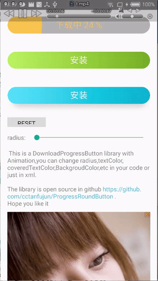

# ProgressRoundButton   [](https://android-arsenal.com/details/1/2660)

A Smooth Download Button with Progress.

## Demo



## Usage

### step1

#### gradle

```groovy
 dependencies {
     compile fileTree(dir: 'libs', include: ['*.jar'])
     compile 'com.android.support:appcompat-v7:23.0.1'
     compile 'com.xiaochendev.progressroundbtn:library:2.0.0'
 }
 ```
### step2 

you can define the button in xml like this:

```xml
<com.xiaochen.progressroundbutton.AnimDownloadProgressButton
        android:id="@+id/anim_btn"
        android:layout_width="match_parent"
        android:layout_height="40dp"
        app:progressbtn_backgroud_color="@android:color/holo_orange_light"
        app:progressbtn_backgroud_second_color="@android:color/holo_green_light"/>
```
### advanced
* If you want shadow and press effect，please use `AnimButton` instead of `AnimDownloadProgressButton` :

```xml
<com.xiaochen.progressroundbutton.AnimButtonLayout
            android:id="@+id/anim_btn3"
            android:layout_width="match_parent"
            android:layout_height="40dp"
            android:layout_marginTop="40dp"
            app:progressbtn_backgroud_color="@android:color/holo_blue_dark"
            app:progressbtn_backgroud_second_color="@android:color/darker_gray"
            app:progressbtn_enable_gradient="true"
            app:progressbtn_enable_press="true"/>
```

* You can also implement your own `ButtonController`,so that you can controll gradient effect;


The Customized properties are in the follow table:
git 

| Property        | Format           | Default  |  
| ------------- |:-------------:| :-----:|  
|progressbtn_radius  |float  |half of the button height  |  
|progressbtn_backgroud_color|color | #6699ff |  
|progressbtn_backgroud_second_color|color|Color.LTGRAY|  
|progressbtn_text_color|color|progressbtn_backgroud_color|  
|progressbtn_text_covercolor|color|Color.WHITE|  
|progressbtn_enable_press|boolean|false|  
|progressbtn_enable_gradient|boolean|false|  

  
 The follow picture make a clear explanation:
 
 
 
 open gradient
 
 
 
 use `AnimDownloadProgressButton`
 
 
 
## Version

* 2.0.0 
	Now you can use press effect;
	Now you can use gradient effect;
	Add AnimButtomLayout with shadow ，when you press the button will be small;

* 1.1.0
  Fix the bug when setProgressText("something",100),first tiem getProgress() return 0;

* 1.0.0   
  Now you can set text size;  
  Add Method removeAllAnim() to avoid memory leak;

* 0.9.1

## About me 

I am a developer in China，If you have any idea about this project，please [contact me](mailto:cctanfujun@163.com)
,Thank you!

## 晓晨Android组
这个是我的公众号，如果你有 Android 开发方面问题可以和我一起讨论，我每周或者每两周会发一两篇原创的Android文章，谢谢支持！


## License

    Copyright 2015 cctanfujun

    Licensed under the Apache License, Version 2.0 (the "License");
    you may not use this file except in compliance with the License.
    You may obtain a copy of the License at

       http://www.apache.org/licenses/LICENSE-2.0

    Unless required by applicable law or agreed to in writing, software
    distributed under the License is distributed on an "AS IS" BASIS,
    WITHOUT WARRANTIES OR CONDITIONS OF ANY KIND, either express or implied.
    See the License for the specific language governing permissions and
    limitations under the License.
